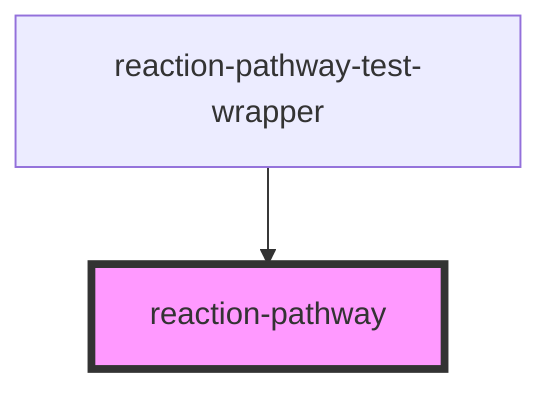

# reaction-pathway

<!-- Auto Generated Below -->

## Overview

The reaction pathway component renders a reaction
pathway from a list of nodes (molecules and reactions)
using a tree layout algorithm and a 3D rendering engine.

## Properties

| Property                   | Attribute                    | Description                                                       | Type                          | Default |
| -------------------------- | ---------------------------- | ----------------------------------------------------------------- | ----------------------------- | ------- |
| `displayHoneycomb`         | `display-honeycomb`          | Enables the honeycomb rendering of the molecules                  | `boolean`                     | `true`  |
| `displayPathway`           | `display-pathway`            | Disables the pathway rendering                                    | `boolean`                     | `true`  |
| `displayReactionCondition` | `display-reaction-condition` | Enables the reaction condition rendering under the reaction nodes | `boolean`                     | `true`  |
| `displayReactionName`      | `display-reaction-name`      | Enables the reaction name rendering under the reaction nodes      | `boolean`                     | `true`  |
| `displayReactionReference` | `display-reaction-reference` | Enables the book icon rendering under the reaction nodes          | `boolean`                     | `true`  |
| `displayScore`             | `display-score`              | Enables the score rendering of the molecules                      | `boolean`                     | `true`  |
| `enable3D`                 | `enable-3-d`                 | Enables the 3D view of the reaction pathway                       | `boolean`                     | `false` |
| `nodes`                    | --                           | The nodes of the reaction pathway                                 | `Omit<Node, "boundingBox">[]` | `[]`    |

## Events

| Event                    | Description | Type                                                     |
| ------------------------ | ----------- | -------------------------------------------------------- |
| `reaction-pathway-click` |             | `CustomEvent<{ node: Node; eventSource: EventSource; }>` |

## Methods

### `zoomIn(zoomSpeed?: number) => Promise<void>`

Allows to zoom in the reaction pathway

#### Returns

Type: `Promise<void>`

### `zoomOut(zoomSpeed?: number) => Promise<void>`

Allows to zoom out the reaction pathway

#### Returns

Type: `Promise<void>`

### `zoomReset() => Promise<void>`

Allows to reset position and zoom levels of the reaction pathway

#### Returns

Type: `Promise<void>`

## CSS Custom Properties

| Name                         | Description                       |
| ---------------------------- | --------------------------------- |
| `--background`               | Background color of the component |
| `--badge-color`              | Color of the badge                |
| `--badge-outline-color`      | Color of the badge outline        |
| `--badge-text-color`         | Color of the badge text           |
| `--honeycomb-border-color`   | Color of the honeycomb border     |
| `--honeycomb-color`          | Color of the honeycomb            |
| `--primary-color`            | Primary color of the component    |
| `--reaction-condition-color` | Color of the reaction condition   |
| `--reaction-doi-color`       | Color of the reaction DOI         |
| `--reaction-name-color`      | Color of the reaction name        |
| `--score-text-color`         | Color of the score text           |

## Dependencies

### Used by

 - [reaction-pathway-test-wrapper](tests)

### Graph

----------------------------------------------

*Built with [StencilJS](https://stenciljs.com/)*
