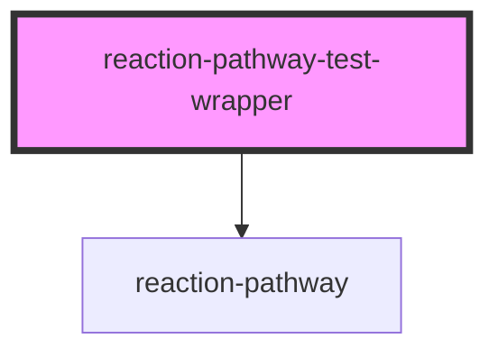

# reaction-pathway-test-wrapper

<!-- Auto Generated Below -->

## Properties

| Property                   | Attribute                    | Description | Type                                                                                                                              | Default     |
| -------------------------- | ---------------------------- | ----------- | --------------------------------------------------------------------------------------------------------------------------------- | ----------- |
| `displayHoneycomb`         | `display-honeycomb`          |             | `boolean`                                                                                                                         | `true`      |
| `displayPathway`           | `display-pathway`            |             | `boolean`                                                                                                                         | `true`      |
| `displayReactionCondition` | `display-reaction-condition` |             | `boolean`                                                                                                                         | `true`      |
| `displayReactionName`      | `display-reaction-name`      |             | `boolean`                                                                                                                         | `true`      |
| `displayReactionReference` | `display-reaction-reference` |             | `boolean`                                                                                                                         | `true`      |
| `displayScore`             | `display-score`              |             | `boolean`                                                                                                                         | `true`      |
| `enable3D`                 | `enable-3-d`                 |             | `boolean`                                                                                                                         | `false`     |
| `type`                     | `type`                       |             | `"general" \| "honeycomb-omitted-data" \| "honeycomb-protected-data" \| "honeycomb-published-data" \| "honeycomb-regulated-data"` | `undefined` |

## Dependencies

### Depends on

- [reaction-pathway](..)

### Graph

----------------------------------------------

*Built with [StencilJS](https://stenciljs.com/)*
